# Études autour du fichier FANTOIR

Ce repository contient le code utilisé pour faire quelques analyses sur le fichier [FANTOIR](https://fr.wikipedia.org/wiki/FANTOIR) qui contient la base de données officielle des noms de rues des communes françaises.

* [Données utilisées](#données-utilisées)
  + [FANTOIR](#fantoir)
  + [Contour communes](#contour-communes)
* [Analyses](#analyses)
  + [Fréquence de type de voie](#fréquence-de-type-de-voie)
  + [Cartographie des types de voie](#cartographie-des-types-de-voie)
  + [Cartographie des noms de voie](#cartographie-des-noms-de-voie)

## Données utilisées

### FANTOIR

L'archive zip contenant le fichier texte ASCII est récupérée sur [data.gouv.fr](https://www.data.gouv.fr/fr/datasets/fichier-fantoir-des-voies-et-lieux-dits/) et décompressée dans un dossier `./fantoir/`.

Le fichier FANTOIR contient ensuite une ligne par lieu, un lieu pouvant être une commune, une voie, un lieu-dit.

Ici, seules les voies et les communes nous intéressent, donc un préprocessing simple permet de créer deux sous-fichiers :
```bash
sed -En '/^[0-9AB]{2}[0-9]{4}[0-9]/p' fantoir/FANTOIR1022 > fantoir/voies.txt

sed -En '/^[0-9AB]{2}[0-9]{4}\s{4}./p' fantoir/FANTOIR1022 > fantoir/communes.txt
```
Explication des regex ci-dessus (se référer au [Descriptif du fichier national FANTOIR](https://data.economie.gouv.fr/api/datasets/1.0/fichier-fantoir-des-voies-et-lieux-dits/attachments/descriptif_du_fichier_national_fantoir_pdf) pour plus d'informations) :
- Les 3 premiers caractères sont le "code direction" (grosso modo le département sur les deux premiers charactères suivi d'un 0, modulo quelques exceptions). Note : on match des chiffres ou A ou B sur les deux premiers caractères, pour gérer la Corse (2A, 2B).
- Les 3 caractères suivants sont le "code commune INSEE".
- Le caractère suivant est le premier caractère du "code RIVOLI", qui est numérique pour les voies normales (le reste sont les ensembles immobiliers, lieux-dits, etc.).

### Contour communes

Une archive zip contenant le contour géographique sous format "géo-vectoriel" des communes est récupéré sur [data.gouv.fr](https://www.data.gouv.fr/fr/datasets/contours-communes-france-administrative-format-admin-express-avec-arrondissements/) et décompressée dans un dossier `./communes/`.


## Analyses

Les analyses sont lancées depuis le Jupyter Notebook `./fantoir.ipynb`.

### Fréquence de type de voie

La motivation initiale était de voir si l'impression que la ville d'Andernos-les-Bains avait proportionnellement beaucoup d'avenues par rapport aux autres communes se confirmait statistiquement.

En lisant le fichier FANTOIR, on peut calculer le pourcentage de type de voie à l'échelle nationale :

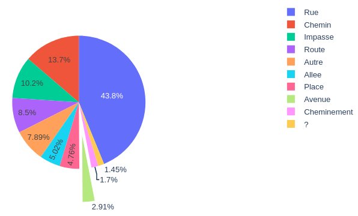

et le comparer au pourcentage de type de voie de la ville d'Andernos-les-Bains :

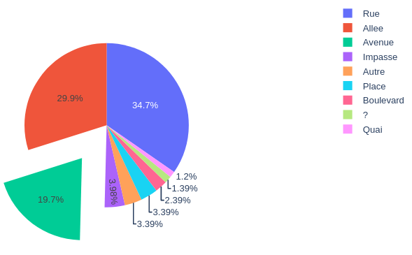

On y voit comme attendu que les avenues sont sur-représentées à Andernos.

On peut également s'intéresser au classement des communes ayant le plus d'avenues en pourcentage :

```
Top 10 des communes avec le plus de voies de type Avenue:
 1. Saint-Lo-D'Ourville (50)      — 60.00% (  12 / 20  )
 2. Cenac (33)                    — 57.14% (  32 / 56  )
 3. Soorts-Hossegor (40)          — 56.19% ( 177 / 315 )
 4. Maisons-Laffitte (78)         — 52.17% ( 132 / 253 )
 5. Le Touquet Paris Plage (62)   — 51.24% ( 103 / 201 )
 6. Beauchamp (95)                — 50.68% (  74 / 146 )
 7. La Baule-Escoublac (44)       — 50.21% ( 352 / 701 )
 8. Grayan-Et-L Hopital (33)      — 48.97% (  95 / 194 )
 9. Rayol Canadel Sur Mer (83)    — 48.84% (  42 / 86  )
10. Theoule-Sur-Mer (06)          — 46.97% (  31 / 66  )

La commune Andernos-les-bains a 19.72% de voies de type Avenue.
Elle se classe dans le top 0.45% des communes françaises avec le plus de voies de type Avenue, sur 29189 communes en tout.
```

On y retrouve beaucoup de stations balnéaires, ou de villes qui se veulent "chic".

### Cartographie des types de voie

#### % rues

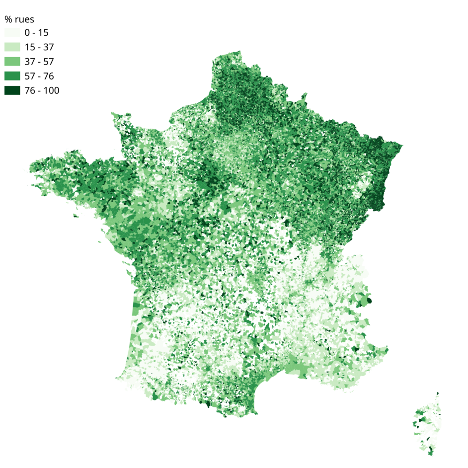

#### % routes

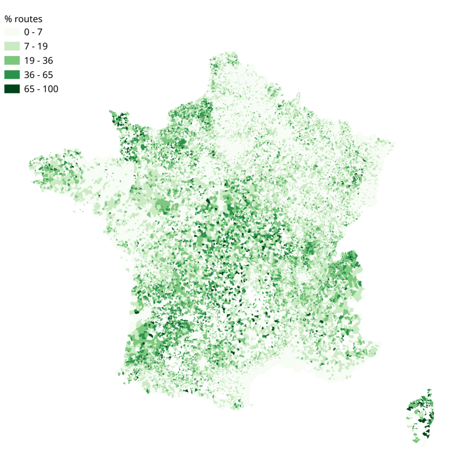

#### % chemins

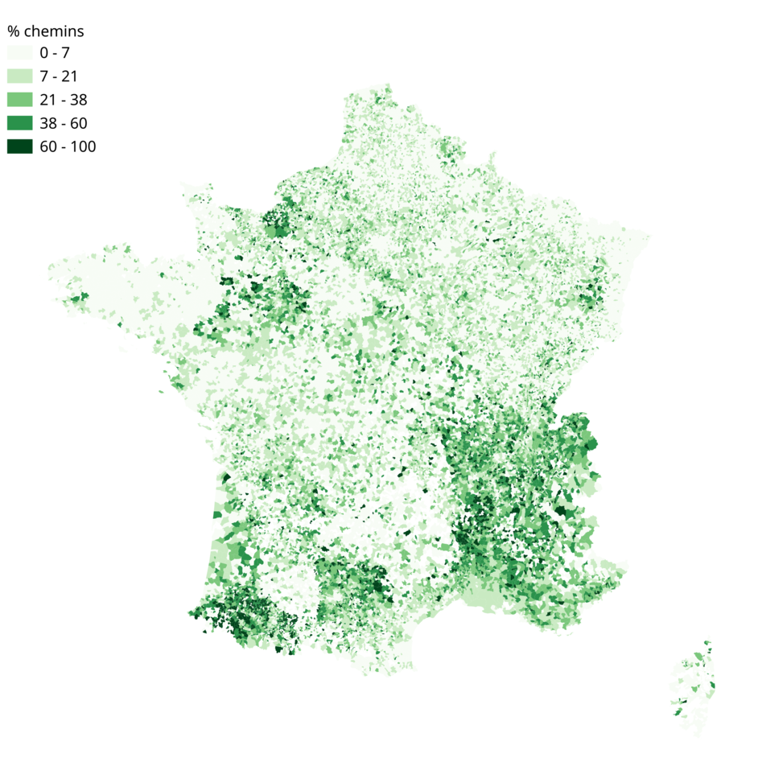

#### % allées

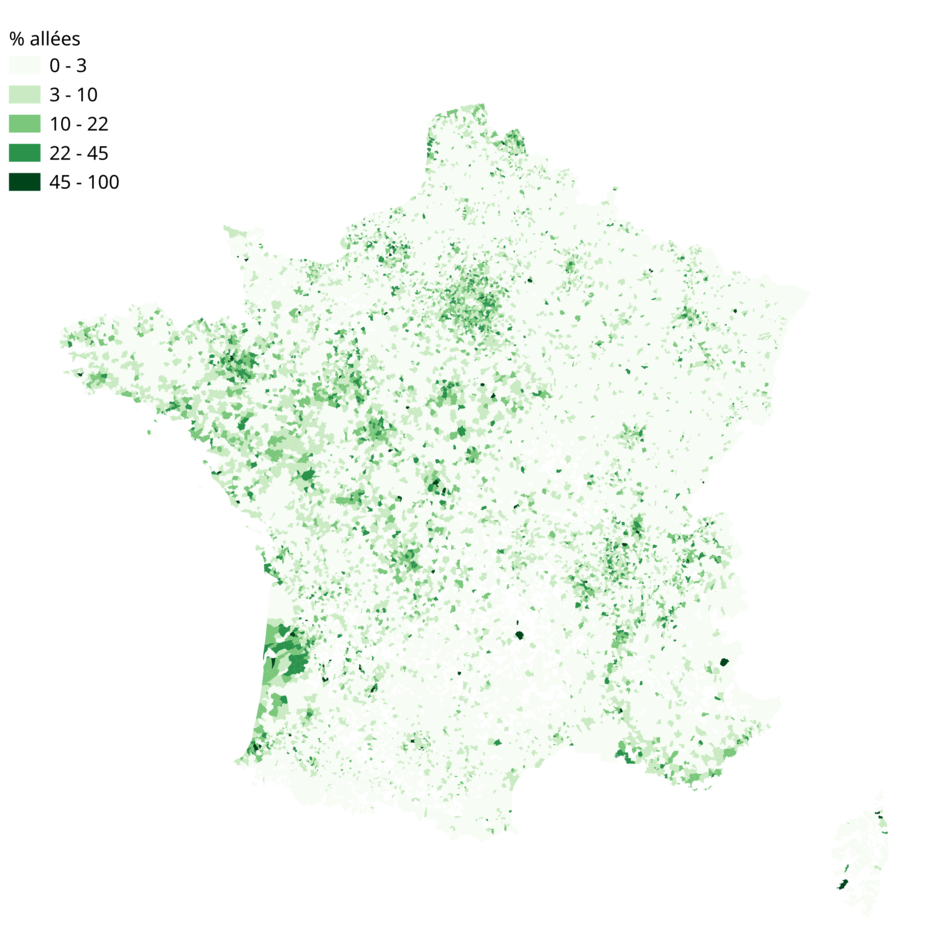

#### nb avenues

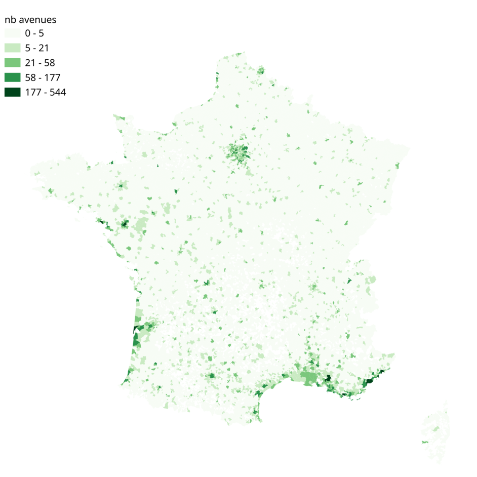

#### nb quais

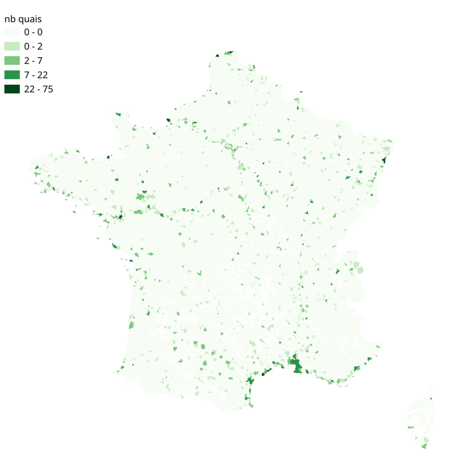

#### nb villas

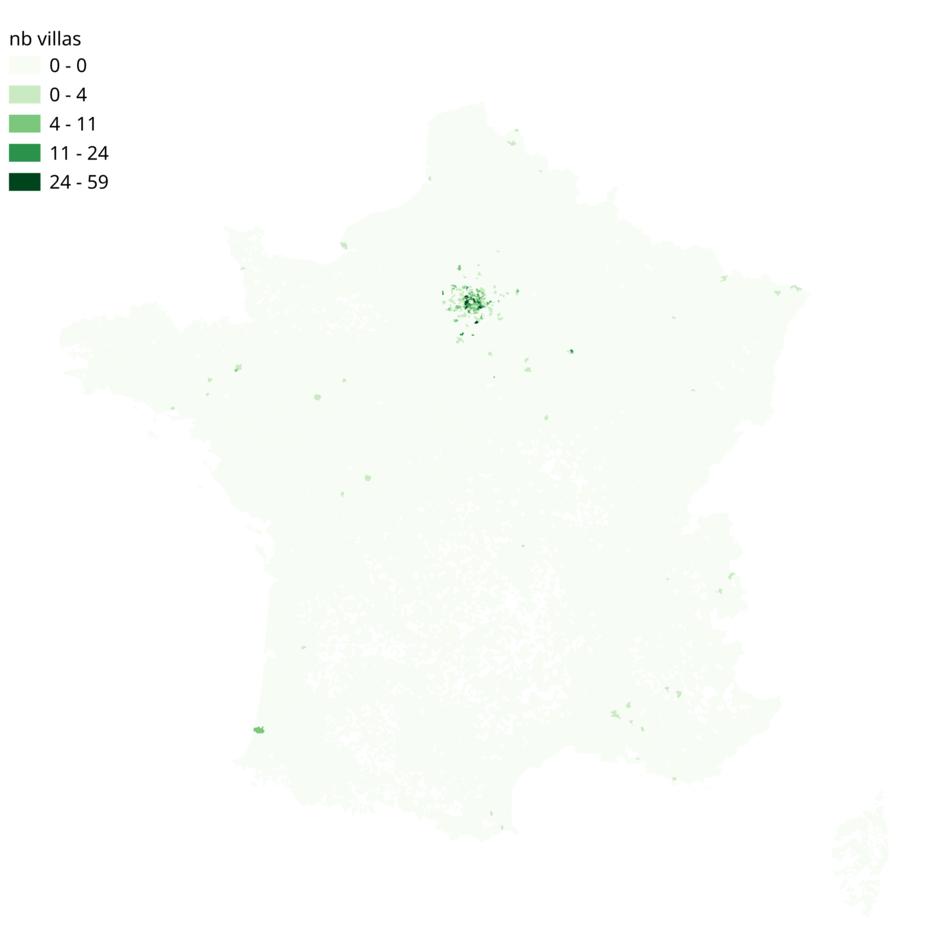

### Cartographie des noms de voie

#### Nom de voie contenant "mouette"

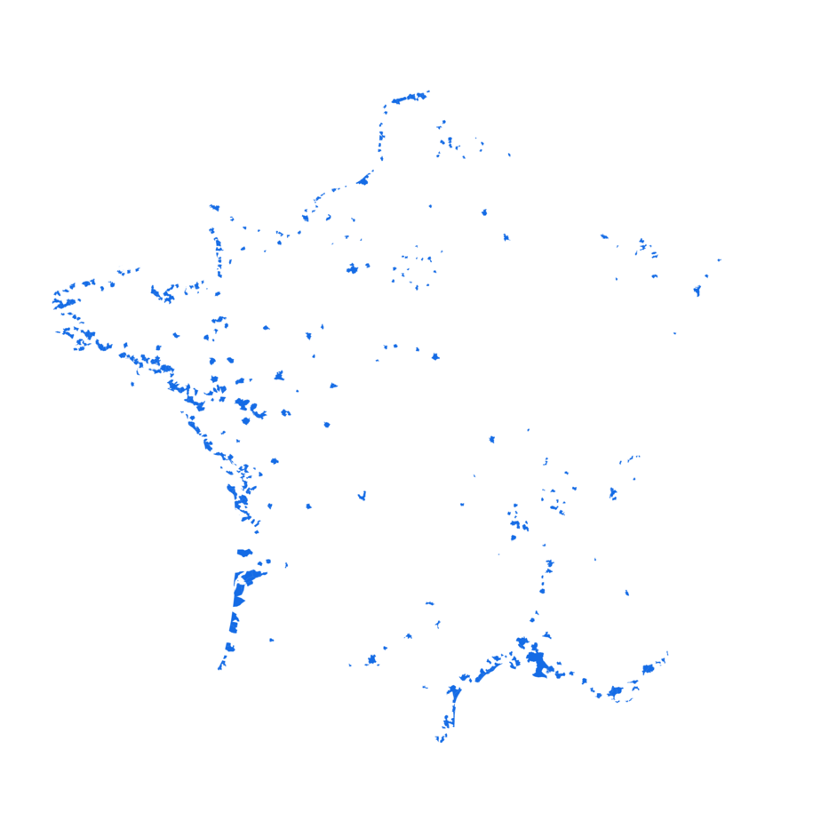

#### Nom de voie contenant "chataign"

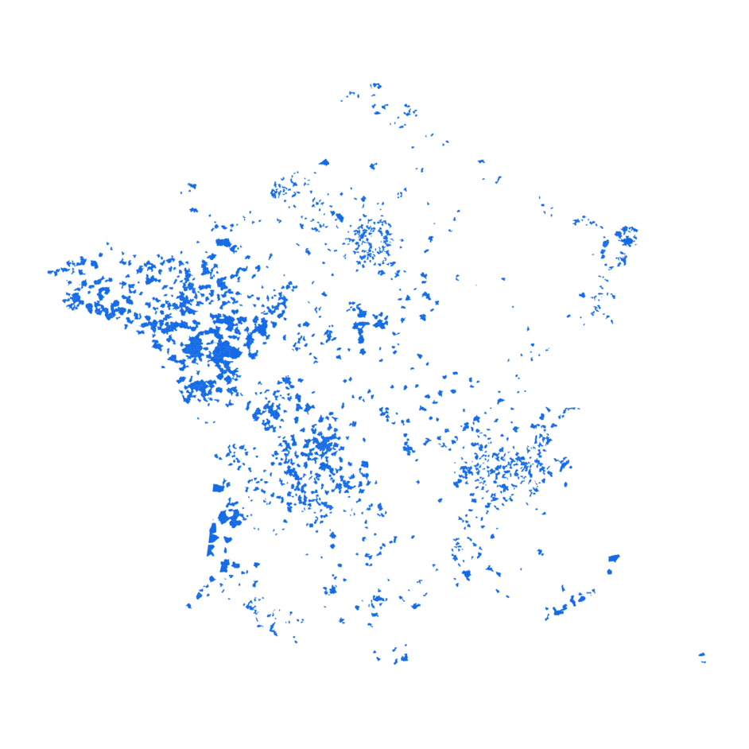

#### Nom de voie contenant "vigne"

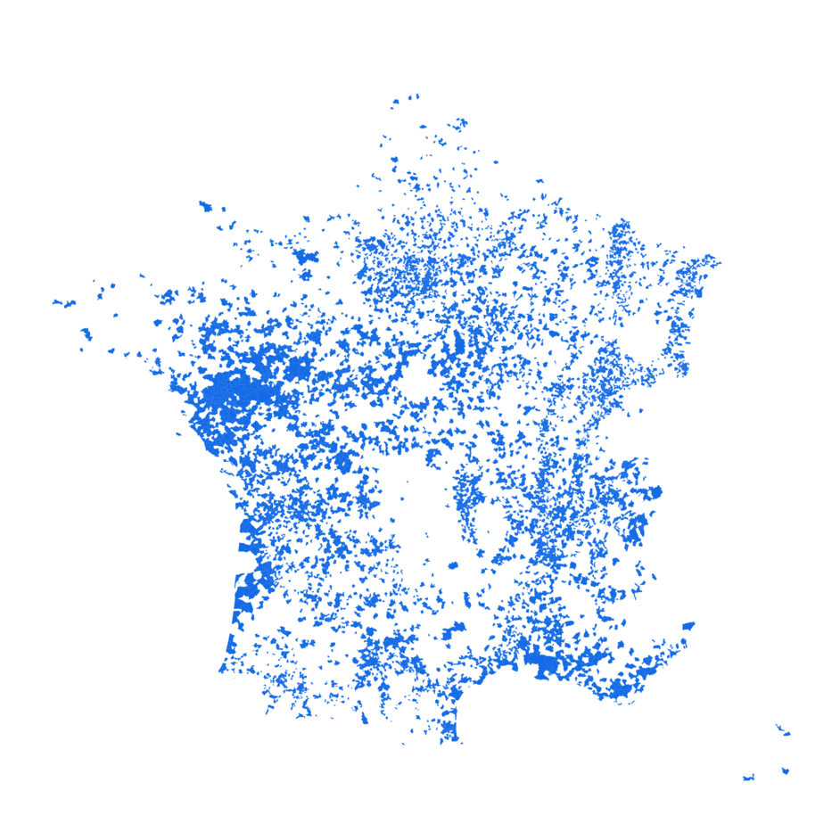

#### Nom de voie contenant "paris"

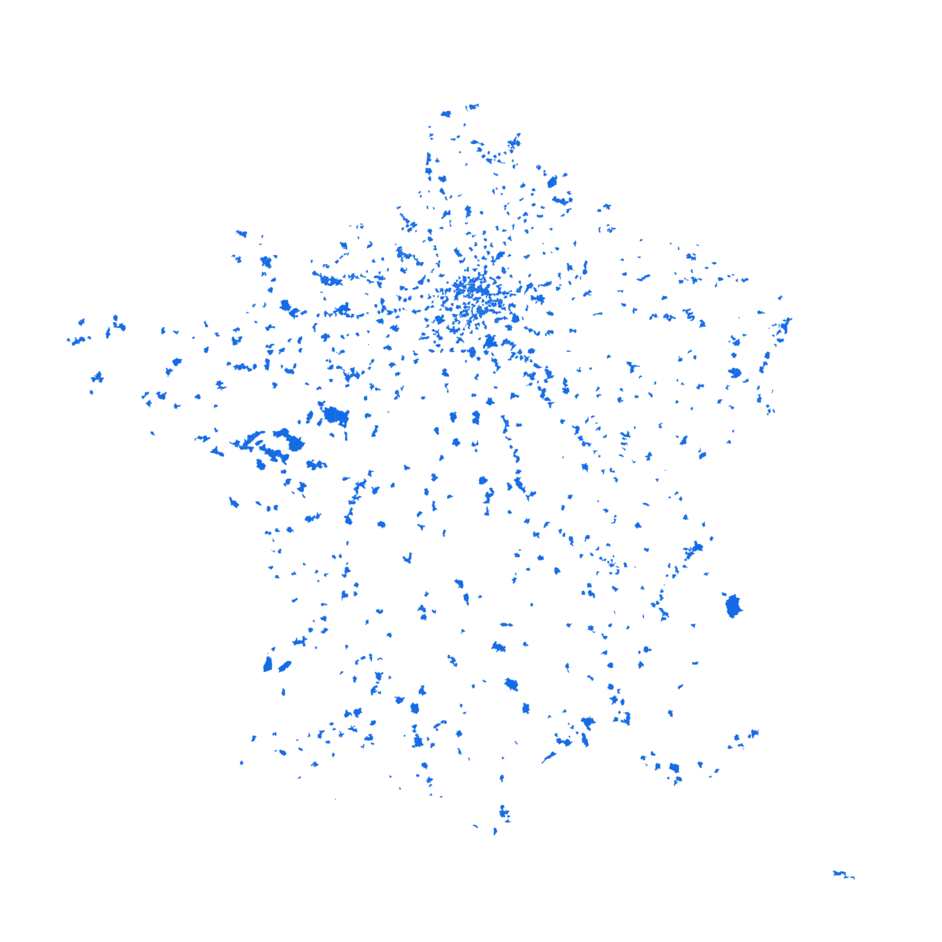
